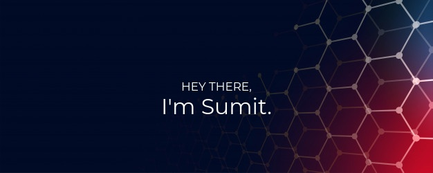

### Hi there 👋

I’m Sumit, a full-stack developer, creative coder and self-proclaimed designer.

Want to know more about me? [Check out my portfolio.](https://sumit2312.github.io/)

 

## 📌 Pinned Repositories
 

 

 

 

### 📦 Languages and Tools: 

<code></code>
<code></code>
<code></code>
<code></code>
<code></code>
<code></code>
<code></code>
<code></code>
<code></code>

 

  
📊 <b><i>GitHub Stats</i></b>

  
  
  
  

<!--
**sumit2312/sumit2312** is a ✨ _special_ ✨ repository because its `README.md` (this file) appears on your GitHub profile.

Here are some ideas to get you started:

- 🔭 I’m currently working on ...
- 🌱 I’m currently learning ...
- 👯 I’m looking to collaborate on ...
- 🤔 I’m looking for help with ...
- 💬 Ask me about ...
- 📫 How to reach me: ...
- 😄 Pronouns: ...
- ⚡ Fun fact: ...
-->
